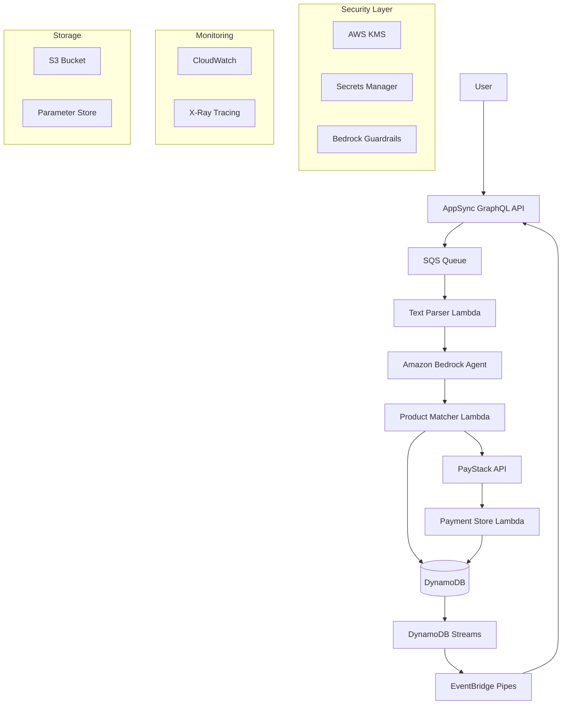

# Design Document: AI Grocery App

## Overview

The AI Grocery App is a serverless, event-driven system built on AWS that transforms natural language grocery lists into secure PayStack payment links. The architecture leverages AWS Bedrock for AI processing, AppSync for real-time GraphQL subscriptions, and a comprehensive suite of AWS services for scalability, reliability, and security.

The system follows a microservices pattern with clear separation of concerns: text processing, AI-powered item extraction, product matching, payment link generation, and real-time notifications. All components are designed for high availability, automatic scaling, and cost optimization.

## Architecture



The architecture implements an asynchronous, event-driven flow that ensures scalability and fault tolerance. Each component can scale independently based on demand, and the system maintains state consistency through DynamoDB transactions and event sourcing patterns.

## Components and Interfaces

### AppSync GraphQL API

**Purpose**: Serves as the primary interface for client applications, handling both mutations for grocery list submission and subscriptions for real-time updates.

**Key Responsibilities**:
- Authentication and authorization using Cognito User Pools
- Input validation and sanitization
- Rate limiting and request throttling
- Real-time subscription management

**GraphQL Schema**:
```graphql
type Mutation {
  submitGroceryList(input: GroceryListInput!): GroceryListResponse!
}

type Subscription {
  groceryListUpdates(orderId: ID!): GroceryListUpdate!
}

type Query {
  getOrder(orderId: ID!): Order
  getPaymentLink(orderId: ID!): PaymentLink
}

input GroceryListInput {
  text: String!
  customerEmail: String!
  customerName: String
}

type GroceryListResponse {
  orderId: ID!
  status: ProcessingStatus!
  estimatedCompletion: AWSDateTime
}

type GroceryListUpdate {
  orderId: ID!
  status: ProcessingStatus!
  items: [ExtractedItem!]
  paymentLink: String
  totalAmount: Float
  error: String
}
```

### Text Parser Lambda

**Purpose**: Receives grocery list text from SQS and performs initial processing and validation before sending to Bedrock.

**Key Responsibilities**:
- Input sanitization and validation
- Text preprocessing and normalization
- Correlation ID generation for tracing
- Error handling and retry logic

**Interface**:
```python
class TextParserInput:
    order_id: str
    raw_text: str
    customer_email: str
    customer_name: Optional[str]
    correlation_id: str

class TextParserOutput:
    order_id: str
    processed_text: str
    metadata: Dict[str, Any]
    correlation_id: str
```

### Bedrock Agent Integration

**Purpose**: Leverages Claude 3.5 Sonnet through Amazon Bedrock to extract structured grocery items from natural language text.

**Agent Configuration**:
- Model: Claude 3.5 Sonnet
- Guardrails: Content filtering for inappropriate requests
- Knowledge Base: Product catalog integration for context
- Action Groups: Custom functions for product lookup

**Prompt Template**:
```
You are a grocery list processing assistant. Extract items from the following text and return structured data.

Input text: {grocery_text}

Return a JSON array of items with this structure:
{
  "items": [
    {
      "name": "item name",
      "quantity": number,
      "unit": "unit of measurement",
      "specifications": ["any specific requirements"],
      "confidence": 0.0-1.0
    }
  ]
}

Rules:
1. Only include actual grocery items
2. Normalize quantities to standard units
3. Include confidence scores for matching
4. Handle ambiguous items with best guess
```

### Product Matcher Lambda

**Purpose**: Matches extracted items against the product catalog and calculates pricing.

**Key Responsibilities**:
- Fuzzy matching against product database
- Price calculation and tax computation
- Inventory availability checking
- Alternative product suggestions

**Matching Algorithm**:
- Primary: Exact name matching
- Secondary: Fuzzy string matching (Levenshtein distance)
- Tertiary: Category-based matching with ML embeddings
- Fallback: Manual review queue for unmatched items

### Payment Processor Lambda

**Purpose**: Integrates with PayStack API to create secure payment links for grocery orders.

**Key Responsibilities**:
- PayStack API integration
- Payment link generation with itemized breakdown
- Transaction security and validation
- Webhook handling for payment status updates

**PayStack Integration**:
```python
class PayStackPayment:
    def create_payment_link(self, order: Order) -> PaymentLink:
        payload = {
            "amount": order.total_amount * 100,  # Convert to kobo
            "currency": "NGN",
            "customer": {
                "email": order.customer_email,
                "name": order.customer_name
            },
            "metadata": {
                "order_id": order.id,
                "items": order.items
            },
            "callback_url": f"{self.base_url}/payment/callback",
            "expires_at": order.created_at + timedelta(hours=24)
        }
        return self.paystack_client.create_payment_link(payload)
```

### Real-Time Notification System

**Purpose**: Manages real-time updates to clients through AppSync subscriptions using EventBridge Pipes.

**Event Flow**:
1. DynamoDB Streams capture data changes
2. EventBridge Pipes transform and route events
3. AppSync receives events and broadcasts to subscribers
4. Clients receive real-time updates via GraphQL subscriptions

**Event Types**:
- `ORDER_CREATED`: Initial order submission
- `ITEMS_EXTRACTED`: AI processing complete
- `ITEMS_MATCHED`: Product matching complete
- `PAYMENT_LINK_CREATED`: PayStack integration complete
- `PROCESSING_ERROR`: Error occurred during processing

## Data Models

### Order Model

```python
@dataclass
class Order:
    id: str  # UUID
    customer_email: str
    customer_name: Optional[str]
    raw_text: str
    status: ProcessingStatus
    created_at: datetime
    updated_at: datetime
    correlation_id: str
    
    # Processing results
    extracted_items: List[ExtractedItem]
    matched_items: List[MatchedItem]
    total_amount: Optional[Decimal]
    payment_link: Optional[str]
    payment_status: Optional[PaymentStatus]
    
    # Metadata
    processing_duration: Optional[int]  # milliseconds
    ai_confidence_score: Optional[float]
    error_details: Optional[str]
```

### ExtractedItem Model

```python
@dataclass
class ExtractedItem:
    name: str
    quantity: float
    unit: str
    specifications: List[str]
    confidence_score: float
    raw_text_segment: str
```

### MatchedItem Model

```python
@dataclass
class MatchedItem:
    extracted_item: ExtractedItem
    product_id: str
    product_name: str
    unit_price: Decimal
    total_price: Decimal
    availability: bool
    match_confidence: float
    alternative_products: List[str]
```

### Product Model

```python
@dataclass
class Product:
    id: str
    name: str
    description: str
    category: str
    unit_price: Decimal
    currency: str
    unit_of_measure: str
    availability: bool
    tags: List[str]
    created_at: datetime
    updated_at: datetime
```

### DynamoDB Table Design

**Orders Table**:
- Partition Key: `order_id`
- Sort Key: `created_at`
- GSI1: `customer_email` (PK), `created_at` (SK)
- GSI2: `status` (PK), `created_at` (SK)

**Products Table**:
- Partition Key: `product_id`
- GSI1: `category` (PK), `name` (SK)
- GSI2: `name` (PK) for fuzzy matching

**PaymentLinks Table**:
- Partition Key: `order_id`
- TTL: `expires_at`
- Contains PayStack payment link details and status

Now I need to use the prework tool to analyze the acceptance criteria before writing the Correctness Properties section.

## Correctness Properties

*A property is a characteristic or behavior that should hold true across all valid executions of a system—essentially, a formal statement about what the system should do. Properties serve as the bridge between human-readable specifications and machine-verifiable correctness guarantees.*

### Property 1: Text Processing Completeness
*For any* valid grocery list text input, the Text_Parser should extract all identifiable grocery items and return structured data with confidence scores
**Validates: Requirements 1.1, 1.2**

### Property 2: Input Filtering Accuracy
*For any* text input containing mixed content, the AI_Agent should process only valid grocery items and filter out non-grocery content
**Validates: Requirements 1.4**

### Property 3: Error Handling for Invalid Input
*For any* empty, null, or invalid text input, the System should return appropriate error messages and maintain system state unchanged
**Validates: Requirements 1.5**

### Property 4: Product Matching Consistency
*For any* extracted grocery item, the Product_Matcher should either find a valid product match or log the item as unmatched, never leaving items in an undefined state
**Validates: Requirements 2.2, 2.4**

### Property 5: Product Data Completeness
*For any* product stored in the Product_Catalog, all required fields (name, description, price, category, availability) should be present and valid
**Validates: Requirements 2.1**

### Property 6: Payment Link Generation Completeness
*For any* successfully matched and priced order, the Payment_Processor should create a PayStack payment link containing itemized breakdown, total amount, and customer reference
**Validates: Requirements 3.1, 3.2**

### Property 7: Payment Link Expiration
*For any* generated payment link, the expiration time should be set to exactly 24 hours from creation time
**Validates: Requirements 3.4**

### Property 8: Payment Processing Validation
*For any* payment link creation request, all amounts and item details should be validated before sending to PayStack API
**Validates: Requirements 3.3**

### Property 9: Retry Logic with Exponential Backoff
*For any* failed PayStack API call, the System should retry up to 3 times with exponential backoff intervals
**Validates: Requirements 3.5**

### Property 10: Real-Time Notification Delivery
*For any* order processing event (submission, extraction, matching, payment link creation), the Real_Time_Notifier should broadcast appropriate status updates to subscribed clients
**Validates: Requirements 4.1, 4.2, 4.3**

### Property 11: Error Notification Content
*For any* processing error, the System should send error notifications containing descriptive messages and correlation IDs for tracing
**Validates: Requirements 4.4, 6.5**

### Property 12: Data Persistence Completeness
*For any* grocery order processing, all order data, extracted items, matched products, and payment links should be stored in DynamoDB with audit trail information
**Validates: Requirements 5.1, 5.3**

### Property 13: Event Streaming Consistency
*For any* data change in DynamoDB, the System should stream the update through DynamoDB Streams to EventBridge Pipes for real-time notifications
**Validates: Requirements 5.2**

### Property 14: Data Encryption at Rest
*For any* sensitive customer data or payment information, the System should encrypt the data using AWS KMS before storing in DynamoDB
**Validates: Requirements 5.4, 7.2**

### Property 15: Dead Letter Queue Processing
*For any* Lambda function failure, the System should route failed messages to appropriate SQS dead letter queues for retry processing
**Validates: Requirements 6.1**

### Property 16: Circuit Breaker Pattern
*For any* external API failure, the System should implement circuit breaker patterns with exponential backoff to prevent cascade failures
**Validates: Requirements 6.2**

### Property 17: Rate Limiting Handling
*For any* Bedrock API rate limit scenario, the System should queue requests and process them when capacity becomes available
**Validates: Requirements 6.3**

### Property 18: Timeout Notification
*For any* processing operation exceeding expected duration, the System should send timeout notifications to users with estimated completion times
**Validates: Requirements 6.4**

### Property 19: API Authentication and Authorization
*For any* API endpoint access attempt, the System should verify authentication and authorization before processing requests
**Validates: Requirements 7.3**

### Property 20: Content Filtering with Guardrails
*For any* grocery list text input, Bedrock Guardrails should filter inappropriate content and prevent processing of non-compliant requests
**Validates: Requirements 7.5**

### Property 21: Load Balancing with SQS
*For any* high-load scenario exceeding system capacity, the System should queue requests using SQS with appropriate backpressure mechanisms
**Validates: Requirements 8.2**

### Property 22: Metrics Emission
*For any* processing stage completion or error occurrence, the System should emit appropriate CloudWatch metrics with relevant dimensions and values
**Validates: Requirements 9.1**

### Property 23: Structured Logging with Correlation
*For any* system operation, logs should be structured with correlation IDs, timestamps, and sufficient context for debugging and tracing
**Validates: Requirements 9.2**

### Property 24: Health Check Implementation
*For any* critical system component, health checks should return accurate status information reflecting component availability and dependencies
**Validates: Requirements 9.3**

### Property 25: Secure Configuration Management
*For any* configuration parameter, the System should store non-sensitive config in Parameter Store and sensitive config in Secrets Manager
**Validates: Requirements 10.1, 10.2**

### Property 26: Environment-Specific Configuration
*For any* deployment environment (dev, staging, production), the System should load appropriate environment-specific configuration values
**Validates: Requirements 10.3**

### Property 27: Dynamic Configuration Reloading
*For any* configuration update, the System should reload new settings without requiring service restarts or downtime
**Validates: Requirements 10.4**

### Property 28: Configuration Validation
*For any* configuration change, the System should validate all parameters before applying changes and reject invalid configurations
**Validates: Requirements 10.5**

## Error Handling

The system implements comprehensive error handling across all components with the following strategies:

### Error Categories and Responses

**Input Validation Errors**:
- Invalid or empty grocery list text
- Malformed customer information
- Response: HTTP 400 with descriptive error message

**Processing Errors**:
- AI agent failures or timeouts
- Product matching failures
- Response: HTTP 500 with correlation ID for tracking

**External Service Errors**:
- PayStack API failures
- Bedrock service unavailability
- Response: Retry with exponential backoff, fallback to error queue

**System Errors**:
- DynamoDB capacity exceeded
- Lambda function timeouts
- Response: Auto-scaling, dead letter queue processing

### Error Recovery Mechanisms

**Circuit Breaker Pattern**: Implemented for all external API calls with configurable failure thresholds and recovery timeouts.

**Exponential Backoff**: Applied to all retry scenarios with jitter to prevent thundering herd problems.

**Dead Letter Queues**: Failed messages are routed to DLQs for manual review and reprocessing.

**Graceful Degradation**: System continues operating with reduced functionality when non-critical components fail.

## Testing Strategy

The testing approach combines unit testing for specific scenarios with property-based testing for comprehensive coverage of system behaviors.

### Unit Testing Approach

**Component-Level Tests**:
- Text parser validation with specific grocery list examples
- Product matching with known catalog items
- PayStack integration with mock API responses
- GraphQL resolver testing with sample queries

**Integration Tests**:
- End-to-end order processing flows
- Real-time notification delivery
- Error handling scenarios
- Security and authentication flows

**Edge Case Testing**:
- Empty or malformed input handling
- Network timeout scenarios
- Rate limiting and throttling
- Data consistency during failures

### Property-Based Testing Configuration

**Testing Framework**: Hypothesis for Python components
**Test Iterations**: Minimum 100 iterations per property test
**Test Data Generation**: Custom generators for grocery lists, product catalogs, and order data

**Property Test Implementation Requirements**:
- Each correctness property must be implemented as a single property-based test
- Tests must be tagged with feature name and property reference
- Tag format: **Feature: ai-grocery-app, Property {number}: {property_text}**
- All tests must include correlation IDs for tracing test execution

**Test Categories**:
- **Functional Properties**: Core business logic validation
- **Integration Properties**: Cross-component behavior verification
- **Security Properties**: Authentication, authorization, and data protection
- **Performance Properties**: Response time and throughput validation (where applicable)

### Test Environment Configuration

**Local Development**: LocalStack for AWS service mocking
**Integration Testing**: Dedicated AWS environment with test data
**Load Testing**: Separate environment for performance validation
**Security Testing**: Automated security scanning and penetration testing

The dual testing approach ensures both specific example validation through unit tests and comprehensive input coverage through property-based testing, providing confidence in system correctness across all scenarios.